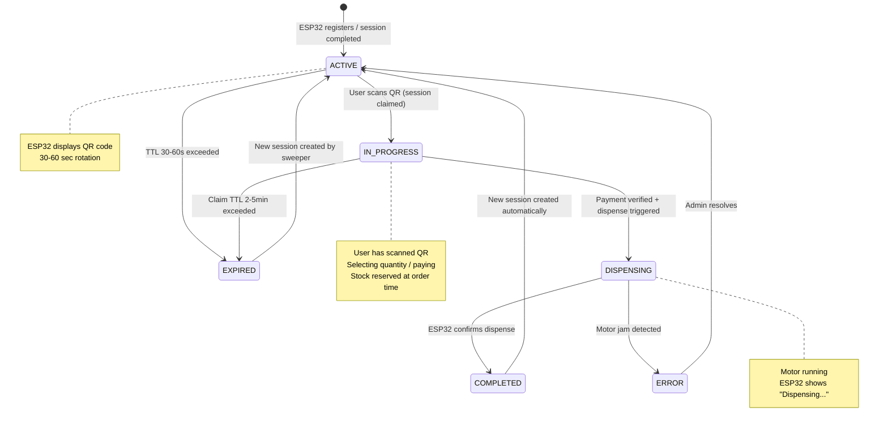
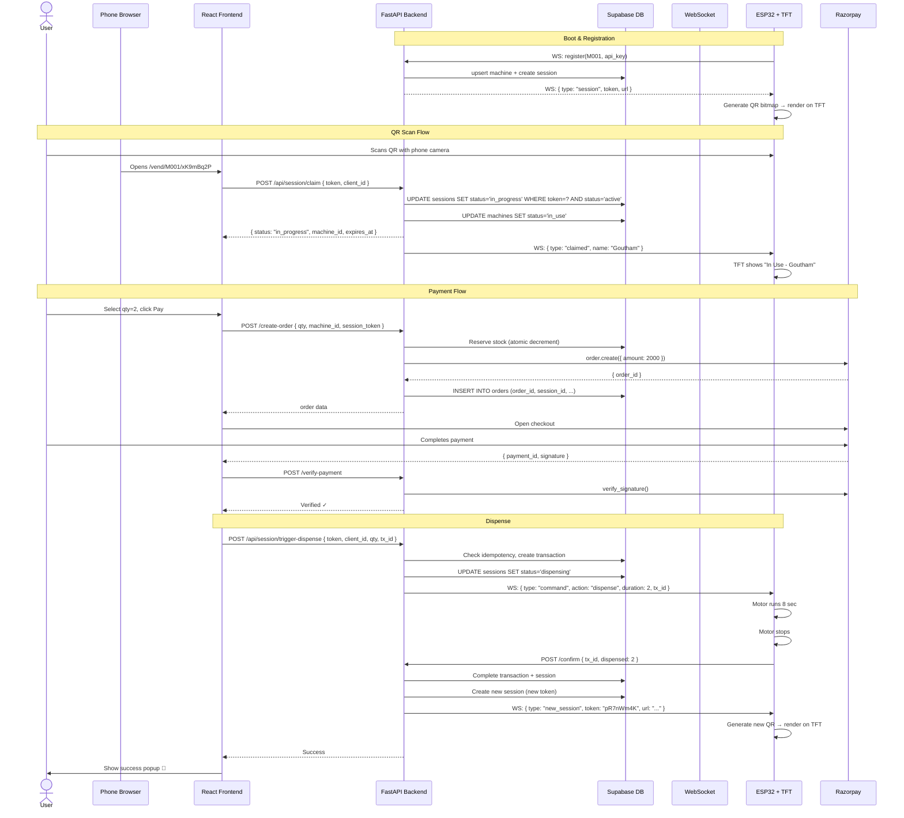

# SmartVend — Production System Workflow (v3.0 — QR-Based)

> Revised with TFT QR code upgrade. Code-entry flow replaced entirely by scan-to-claim.

---

## 🧠 System Overview

```text
ESP32 → boots → WebSocket connect → registers → gets session_token from backend
↓
TFT renders QR code: https://smartvend.onrender.com/vend/{machine_id}/{session_token}
↓
User scans QR with phone camera → browser opens session URL
↓
Backend validates session_token → marks session IN_PROGRESS → locks machine
↓
User selects quantity → pays via Razorpay
↓
Backend verifies payment → triggers dispense command
↓
ESP32 dispenses → confirms → backend completes session → ESP32 fetches new QR
↓
System ready for next user
```

### What Changed from v2.0 (Code-Entry)

| Aspect | v2.0 (Code Entry) | v3.0 (QR Scan) |
|---|---|---|
| **Hardware** | 16×2 LCD | 2.4" TFT (ILI9341, 240×320, 8-bit parallel) |
| **User action** | Type 6-digit code into app | Scan QR with phone camera |
| **Session ID** | 6-digit display_code (collision risk) | UUID/token (cryptographic, unique) |
| **Entry point** | User navigates to app, selects machine | QR URL opens specific machine + session directly |
| **Lock trigger** | `POST /api/lock-by-code { code }` | `GET /vend/{machine_id}/{session_token}` (page load = claim) |
| **Collision risk** | High (6-digit across machines) | Zero (UUID per session) |
| **UX** | 4-step (open app → find machine → enter code → lock) | 1-step (scan → done) |

---

## 🧩 Session States

```text
ACTIVE ──→ IN_PROGRESS ──→ DISPENSING ──→ COMPLETED
   │            │                            │
   ↓            ↓                            ↓
EXPIRED      EXPIRED                    (new ACTIVE)
```

### State Definitions

> **Terminology guide**: `claimed` = verb (the action of scanning QR). `in_progress` = session state. `in_use` = machine status.

| Session State | DB: `sessions.status` | DB: `machines.status` | Duration | TFT Display |
|---|---|---|---|---|
| **ACTIVE** | `'active'` | `'idle'` | 30–60 sec (QR rotation) | QR code shown |
| **IN_PROGRESS** | `'in_progress'`, `claimed_by = client_id` | `'in_use'` | 2–5 min (payment timeout) | "In Use" / user name |
| **DISPENSING** | `'dispensing'` | `'dispensing'` | ~5–30 sec (motor run) | "Dispensing..." |
| **COMPLETED** | `'completed'` | `'idle'` (auto-reset) | Instant → new ACTIVE | Briefly "Done!" → new QR |
| **EXPIRED** | `'expired'` | `'idle'` (auto-reset) | Auto-transitions to ACTIVE | New QR auto-generated |

---

## ⏱ Timers

| Timer | Value | Purpose |
|---|---|---|
| **Session TTL (QR rotation)** | 30–60 sec | Rotate QR when nobody scans. Short = secure. |
| **Claim TTL (Payment timeout)** | 2–5 min | Max time user has after scanning to complete payment |
| **Motor Run Timeout** | quantity × 4 sec | Auto-stop motor |
| **ESP32 Local Lock Timeout** | 10 min | Failsafe if server unreachable |
| **Heartbeat** | 30 sec | WebSocket keep-alive |

> **KEY INSIGHT**: With QR codes, 30–60 sec session TTL is *correct* — user just scans, no typing.
> The old 5–10 min TTL was needed because users had to manually type a code.

---

## 🔗 URL Structure

```
https://smartvend.onrender.com/vend/{machine_id}/{session_token}

Example:
https://smartvend.onrender.com/vend/M001/a7f3c9e1-82b4-4d1a-9f6e-3b8c2d5e7a01
```

### URL Components

| Part | Source | Purpose |
|---|---|---|
| `/vend/` | Fixed route | Frontend route for vending flow |
| `{machine_id}` | e.g. `M001` | Identifies which machine |
| `{session_token}` | UUID v4, generated by backend | Unique, single-use session identifier |

### Why Both machine_id AND session_token?

1. `machine_id` lets the frontend immediately show machine info (name, location, stock)
2. `session_token` provides cryptographic uniqueness — no collision, no guessing
3. Backend validates: "Does session_token belong to machine_id AND is it still ACTIVE?"

---

## 📊 New Database Schema

### `sessions` table (replaces `display_code` fields on `machines` + `locks` table)

```sql
CREATE TABLE IF NOT EXISTS sessions (
  id UUID DEFAULT gen_random_uuid() PRIMARY KEY,
  session_token TEXT NOT NULL UNIQUE,          -- UUID v4 string, used in QR URL
  machine_id TEXT NOT NULL REFERENCES machines(machine_id),
  status TEXT NOT NULL DEFAULT 'active'
    CHECK (status IN ('active', 'in_progress', 'dispensing', 'completed', 'expired')),
  claimed_by TEXT,                             -- client_id of the user who scanned
  claimed_at TIMESTAMPTZ,
  expires_at TIMESTAMPTZ NOT NULL,             -- session TTL (30-60s) or claim TTL (2-5min)
  created_at TIMESTAMPTZ DEFAULT NOW(),
  completed_at TIMESTAMPTZ
);

-- Only ONE active/in_progress session per machine at any time
CREATE UNIQUE INDEX idx_sessions_active_machine
  ON sessions (machine_id)
  WHERE status IN ('active', 'in_progress', 'dispensing');

-- For sweeper: find expired sessions efficiently
CREATE INDEX idx_sessions_expired
  ON sessions (expires_at)
  WHERE status IN ('active', 'in_progress');
```

### `machines` table changes

```sql
-- Remove these columns (no longer needed):
--   display_code
--   display_code_expires_at
-- The session_token in the sessions table replaces display_code entirely.

-- Keep everything else:
--   machine_id, api_key, current_stock, status, last_seen_at, last_refill_at
```

### `orders` table (for webhook reconciliation)

```sql
CREATE TABLE IF NOT EXISTS orders (
  order_id TEXT PRIMARY KEY,                   -- Razorpay order_id
  session_id UUID REFERENCES sessions(id),
  machine_id TEXT REFERENCES machines(machine_id),
  client_id TEXT,
  quantity INT,
  amount INT,
  reserved_stock BOOLEAN DEFAULT TRUE,
  created_at TIMESTAMPTZ DEFAULT NOW()
);
```

### `events` table (audit log)

```sql
CREATE TABLE IF NOT EXISTS events (
  id UUID DEFAULT gen_random_uuid() PRIMARY KEY,
  machine_id TEXT REFERENCES machines(machine_id),
  session_id UUID REFERENCES sessions(id),
  event_type TEXT NOT NULL,  -- 'session_created', 'session_claimed', 'payment', 'dispense', 'error', 'jam'
  client_id TEXT,
  payload JSONB,
  created_at TIMESTAMPTZ DEFAULT NOW()
);
```

---

## 🖥️ ESP32 Hardware Changes

### Display: 2.4" TFT ILI9341 (240×320 pixels, 8-bit parallel)

**Libraries required**:
- `TFT_eSPI` — ILI9341 TFT driver (parallel mode)
- `qrcode.h` (QRCode library by ricmoo) — QR generation on-device

**QR Code Constraints**:
- 240×320 display allows large QR rendering (up to ~200×200)
- QR Version 4+ with LOW ECC is sufficient for session URL length
- Keep URL compact: short session tokens improve readability/scanning speed

### Optimized Token Format

Instead of full UUID (`a7f3c9e1-82b4-4d1a-9f6e-3b8c2d5e7a01` = 36 chars), use a **short token**:

```
Full URL: https://smartvend.onrender.com/vend/M001/xK9mBq2P
                                                     ^^^^^^^^
                                              8-char base62 (62^8 = 218 trillion combinations)
```

Total URL length: ~55 chars → renders clearly on TFT at high module scale

**Backend generates**: `secrets.token_urlsafe(6)` → 8 base64url chars

### ESP32 Display Modes

```text
State ACTIVE:       [QR code rendered, large centered area] or QR + "Scan Me" text
State IN_PROGRESS:  "In Use"  +  user name (if sent)
State DISPENSING:   "Dispensing..."  +  animation
State COMPLETED:    "Done! ✓"  (brief flash)
State ERROR:        "Error! Contact Support"
```

---

## 🚀 1️⃣ NORMAL SUCCESS FLOW

```text
ESP32 boots → WiFi → health check → WebSocket connect
↓
ESP32 → WS: { type: "register", machine_id: "M001", api_key: "sv_001mmsg" }
↓
Backend:
  1. Upserts machine row
  2. Creates new session { session_token: "xK9mBq2P", machine_id: "M001", status: "active", expires_at: now+60s }
  3. Responds WS: { type: "session", token: "xK9mBq2P", url: "https://smartvend.onrender.com/vend/M001/xK9mBq2P" }
↓
ESP32:
  1. Receives session URL
  2. Generates QR code bitmap from URL using qrcode library
  3. Renders on TFT (large centered QR area)
↓
User → walks up to machine → scans QR with phone camera
↓
Phone browser opens: https://smartvend.onrender.com/vend/M001/xK9mBq2P
↓
Frontend (React):
  1. Extracts machine_id ("M001") and session_token ("xK9mBq2P") from URL params
  2. Generates/reads client_id from localStorage
  3. POST /api/session/claim { session_token: "xK9mBq2P", client_id: "abc123" }
↓
Backend:
  1. Finds session by token → validates status = 'active' AND not expired
  2. Atomic update: UPDATE sessions SET status='in_progress', claimed_by=$1, expires_at=now+5min
     WHERE session_token=$2 AND status='active'
     RETURNING *
  3. If no row returned → session already claimed or expired → 409
  4. Update machines.status = 'in_use'
  5. Send WS to ESP32: { type: "claimed", claimed_by_name: "Goutham" }
  6. Log event: session_claimed
↓
ESP32 → TFT shows "In Use" + "Goutham"
↓
Frontend → shows quantity selector + machine info
↓
User → selects quantity=2 → clicks "Pay ₹20"
↓
Frontend → POST /create-order { quantity: 2, machine_id: "M001", session_token: "xK9mBq2P" }
↓
Backend:
  1. Validate session is still in_progress and owned by client_id
  2. Reserve stock atomically: UPDATE SET current_stock = current_stock - 2 WHERE current_stock >= 2
  3. Create Razorpay order
  4. Store order_id ↔ session mapping in orders table
  5. Return order details to frontend
↓
Frontend → opens Razorpay checkout → user pays
↓
Razorpay → returns { payment_id, order_id, signature }
↓
Frontend → POST /verify-payment → Backend verifies signature → "Payment verified"
↓
Frontend → POST /api/session/trigger-dispense { session_token, client_id, quantity, transaction_id }
↓
Backend:
  1. Validate session ownership
  2. Check idempotency in transactions table (not in-memory!)
  3. Create transaction row
  4. Update session status = 'dispensing'
  5. Send WS: { type: "command", action: "dispense", duration: 2, transaction_id: "txn_xxx" }
↓
ESP32 → TFT "Dispensing..." → motor runs for 2 × 4000ms
↓
ESP32 → motor stops → POST /api/machine/M001/confirm { transaction_id, dispensed: 2 }
↓
Backend:
  1. Update transaction → completed
  2. Update session status = 'completed'
  3. Create NEW session { token: "pR7nWm4K", status: "active", expires_at: now+60s }
  4. Set machines.status = 'idle'
  5. Send WS: { type: "new_session", token: "pR7nWm4K", url: "...new QR URL..." }
  6. Check low stock → email if needed
↓
ESP32 → generates new QR from new URL → renders on TFT
↓
Frontend → shows success popup → feedback form
```

✅ One-scan UX (no code typing)  
✅ Cryptographic session tokens (no collision)  
✅ Atomic claim (no race condition)  
✅ Full audit trail

---

## ⏱ 2️⃣ QR EXPIRES BEFORE SCAN (Nobody Scans)

```text
ESP32 shows QR for session "xK9mBq2P"
↓
30–60 seconds pass, nobody scans
↓
Session Expiry Sweeper:
  → UPDATE sessions SET status='expired' WHERE status='active' AND expires_at < NOW()
  → For each expired: create new session for that machine
  → Send WS: { type: "new_session", token: "NEW_TOKEN", url: "...new URL..." }
↓
ESP32 → receives new session → generates new QR → renders on TFT
```

✅ Automatic rotation  
✅ Short TTL (30–60s) for security  
✅ Old QR becomes invalid immediately

---

## 🕒 3️⃣ USER SCANS BUT DOES NOTHING (Abandons)

```text
User scans QR → session claimed → IN_PROGRESS
↓
expires_at = now + 5 min (claim TTL)
↓
User walks away / idle / doesn't pay
↓
5 min passes → session expires
↓
Sweeper:
  → UPDATE sessions SET status='expired' WHERE status='in_progress' AND expires_at < NOW()
  → Release reserved stock (if order was created): UPDATE machines SET current_stock = current_stock + qty
  → Create new session for machine
  → Send WS: new_session to ESP32
↓
ESP32 → new QR → machine available
```

✅ Machine auto-recovers  
✅ Stock reservation released  
✅ No manual intervention needed

---

## 💳 4️⃣ PAYMENT FAILED

```text
User scans → session IN_PROGRESS → selects quantity → pays
↓
Payment FAILS (insufficient balance, bank decline, user cancels)
↓
Razorpay returns failure to frontend
↓
Frontend:
  1. Shows "Payment failed. Try again or cancel"
  2. User can retry payment (session still valid within TTL)
  3. OR user can cancel: POST /api/session/cancel { session_token, client_id }
↓
Backend on cancel:
  1. Release stock reservation
  2. Set session status = 'expired'
  3. Create new session → send to ESP32
↓
If user just leaves → claim TTL (5 min) handles cleanup
```

✅ Retry-friendly (session stays open)  
✅ Explicit cancel option  
✅ No money charged, no dispense

---

## ❌ 5️⃣ PAYMENT SUCCESS + ESP32 OFFLINE

```text
User pays → backend receives verification
↓
Sends dispense WS command → ESP32 is disconnected
↓
Command stored in pending_http_commands + Redis pub
↓
ESP32 reconnects WiFi → reconnects WebSocket → registers
↓
Backend: sends any pending commands for this machine
↓
ESP32 receives dispense command → dispenses → confirms
```

✅ Pending command queue  
✅ Redis cross-worker delivery  
✅ ESP32 polls `/device/commands/{id}` as fallback

---

## ⚠️ 6️⃣ TWO USERS SCAN SAME QR

```text
User A scans QR → POST /api/session/claim { token: "xK9mBq2P" }
↓
Backend:
  UPDATE sessions SET status='in_progress', claimed_by='userA'
  WHERE session_token='xK9mBq2P' AND status='active'
  RETURNING *
↓
User A: 1 row returned → claimed ✅
↓
User B scans SAME QR → POST /api/session/claim { token: "xK9mBq2P" }
↓
Backend:
  UPDATE sessions SET ... WHERE session_token='xK9mBq2P' AND status='active'
  → 0 rows returned (status is now 'in_progress', not 'active')
  → Return 409: "Session already claimed"
↓
User B sees: "This session is already in use. Please wait for a new QR."
```

✅ Atomic UPDATE with WHERE status='active' — no race condition  
✅ Only first scanner wins  
✅ Clear error for second user  
✅ **Much better than v2.0** — no TOCTOU vulnerability

---

## 🔁 7️⃣ USER RELOADS PAGE

```text
User scanned QR → session IN_PROGRESS → page reloads
↓
Browser reloads: /vend/M001/xK9mBq2P
↓
Frontend:
  1. Reads client_id from localStorage
  2. GET /api/session/status { session_token: "xK9mBq2P", client_id: "abc123" }
↓
Backend:
  Checks session → status='in_progress', claimed_by='abc123' → match ✅
  → Returns { status: 'in_progress', machine_id, expires_at, already_claimed: true }
↓
Frontend:
  Recognizes this is a resume → shows payment page with countdown
  (does NOT re-claim, just resumes)
```

✅ Seamless resume  
✅ No double-claim attempt  
✅ Session URL is the bookmark

---

## 📵 8️⃣ SLOW INTERNET — SESSION EXPIRES BEFORE PAGE LOADS

```text
User scans QR → phone opens browser → network is slow
↓
By the time /api/session/claim reaches backend:
  session.expires_at has passed (30-60 sec TTL)
↓
Backend: session not found or expired → 410 Gone
↓
Frontend: "This session has expired. Please scan the new QR code on the machine."
↓
ESP32 already has a new QR displayed
↓
User re-scans the new QR
```

✅ Expected behavior  
✅ Clear user message  
✅ Fast recovery (just re-scan)

---

## 🔌 9️⃣ ESP32 RESTARTS

```text
ESP32 power cycles
↓
setup():
  1. Connect best WiFi
  2. waitForHealth() with backoff
  3. WebSocket SSL connect
  4. Send register
↓
Backend:
  1. Upserts machine
  2. Expires any old active/in_progress session for this machine
  3. Creates new session → sends token + URL to ESP32
↓
ESP32 → generates QR → displays on TFT
```

✅ Stateless device  
✅ Old session auto-expired  
✅ Fresh start guaranteed

---

## ⚙️ 🔟 MOTOR JAM

```text
Payment verified → dispense command sent
↓
ESP32 → motor runs → current spike on GPIO 34 > threshold for > 200ms
↓
ESP32:
  1. motorStop()
  2. WS: { type: "error", error: "motor_jam", transaction_id: "txn_xxx" }
  3. TFT: "Error! Contact Support"
  4. Stays in current state (no auto-unlock)
↓
Backend:
  1. Log to events table { event_type: 'jam', machine_id, session_id }
  2. Send email alert to admin
  3. Update machine.status = 'error'
  4. Session stays 'dispensing' until admin resolves
↓
Admin: fixes jam → manually triggers re-dispense or refund via dashboard
```

✅ Safety — motor stops immediately  
✅ Machine blocked from new users  
✅ Admin alerted

---

## 🔄 1️⃣1️⃣ REPLAY ATTACK

```text
User completed purchase → session "xK9mBq2P" status = 'completed'
↓
Attacker bookmarked URL, re-opens it
↓
Frontend → GET /api/session/status { token: "xK9mBq2P" }
↓
Backend: session status = 'completed' → 410 Gone "Session completed"
↓
Frontend: "This session has been used. Please scan the current QR."
↓
No access to payment or dispense
```

✅ Sessions are cryptographically unique + single-use  
✅ Completed sessions can never be re-claimed  
✅ URL becomes dead after use

---

## 🧍 1️⃣2️⃣ TAB CLOSED AFTER PAYMENT (CRITICAL)

```text
User pays → Razorpay captures payment
↓
User closes tab BEFORE frontend calls /trigger-dispense
↓
Razorpay webhook → POST /api/razorpay-webhook (event: payment.captured)
↓
Backend:
  1. Verify webhook signature
  2. Extract order_id from payload
  3. Look up orders table → find session_id, machine_id, client_id, quantity
  4. Check: does a transaction exist for this order_id?
  5. If NO:
     a. Create transaction { payment_status: 'webhook_captured' }
     b. Update session status = 'dispensing'
     c. Send dispense command to ESP32
     d. Log event: 'webhook_auto_dispense'
  6. If YES:
     → Already handled, skip
↓
ESP32 → receives dispense → motor runs → confirms
↓
Backend → completes transaction → creates new session → new QR
```

✅ **No money lost** — webhook catches orphaned payments  
✅ Automatic dispense without user interaction  
✅ Full audit trail

---

## 🔐 1️⃣3️⃣ FAKE/INVALID QR URL

```text
User navigates to: /vend/M001/INVALID_TOKEN_HERE
↓
Frontend → POST /api/session/claim { token: "INVALID_TOKEN_HERE" }
↓
Backend: SELECT WHERE session_token = '...' → 0 rows → 404 Not Found
↓
Frontend: "Invalid session. Please scan the QR code on the machine."
```

✅ Cryptographic tokens can't be guessed (8-char base64url = 2.8 × 10¹⁴ possibilities)  
✅ Rate-limited endpoint

---

## 🔁 1️⃣4️⃣ BACKEND DOWN

```text
ESP32 → health check fails → retries 5x with backoff
↓
All fail:
  TFT shows "Service Unavailable" (text mode, no QR)
  ESP32 retries every 30 sec
↓
Backend comes up → ESP32 connects → registers → gets session → shows QR
```

✅ Graceful degradation  
✅ Clear user feedback on TFT  
✅ Auto-recovery

---

## 🔄 1️⃣5️⃣ HIGH TRAFFIC

```text
Machine M001 shows QR on TFT
↓
User A scans QR → POST /api/session/claim → session claimed ✅
↓
Backend → WS: { type: "claimed", name: "User A" } → ESP32
↓
ESP32 → TFT switches from QR to "In Use - User A"
        (QR is NO LONGER visible on the machine)
↓
User B walks up → sees "In Use" on TFT → knows to wait
↓
User B, C CANNOT scan (no QR displayed!)
↓
Tiny race window: If User B scanned the QR in the ~100ms before
TFT updated → backend returns 409 "Already claimed" → safe
↓
User A completes → backend creates new session → ESP32 renders new QR
↓
User B sees new QR → scans → claims ✅
```

✅ **Physical barrier**: QR removed from TFT on claim — others can't scan  
✅ **Backend barrier**: Even if scanned during race window → 409 rejection  
✅ Short cycles (30s idle + 5min max claim = fast turnover)  
✅ Fair: first to scan wins

---

## 📝 SYSTEM RULES (Final v3.0)

### Rule 1: One Active Session Per Machine
```
Only ONE session with status IN ('active', 'in_progress', 'dispensing') per machine.
Enforced by: UNIQUE partial index on sessions(machine_id) WHERE status IN (...).
```

### Rule 2: Sessions Are Single-Use
```
A session_token is used exactly once: active → in_progress → dispensing → completed.
Once completed or expired, the token is dead forever.
A NEW token is generated for every cycle.
```

### Rule 3: Dual TTL System
```
QR Session TTL:  30–60 sec  (rotation when idle, nobody scanned)
Claim TTL:       2–5 min    (after scan, time to complete payment)
These are SEPARATE config values:
  SESSION_TTL_SECONDS=60
  CLAIM_TTL_MINUTES=5
```

### Rule 4: Stock Reservation is Atomic
```
Stock decremented BEFORE payment via:
  UPDATE machines SET current_stock = current_stock - qty WHERE current_stock >= qty
Released on: payment failure, session expiry, explicit cancel.
```

### Rule 5: ESP32 is Stateless (Rendering Only)
```
ESP32 renders what the server tells it. Period.
  - Server sends session URL → ESP32 generates QR locally
  - Server sends "claimed" → ESP32 shows "In Use"  
  - Server sends "dispense" → ESP32 runs motor
  - Server sends "new_session" → ESP32 renders new QR
ESP32's 10-min local timeout is a safety net, not a business rule.
```

### Rule 6: Every Transition is Logged
```
All state changes → events table.
session_created, session_claimed, session_expired, payment_success, 
payment_failed, dispense_started, dispense_confirmed, motor_jam, webhook_capture
```

### Rule 7: Webhook Reconciliation
```
Razorpay webhook is the SAFETY NET for lost frontend calls.
If payment.captured but no transaction → auto-dispense.
NEVER lose a customer's money.
```

---

## 🔌 New API Endpoints

### Session Management (replaces /api/lock-by-code)

| Method | Endpoint | Who Calls | Purpose |
|---|---|---|---|
| `POST` | `/api/session/create` | Internal (on register, on completion) | Create new active session |
| `POST` | `/api/session/claim` | Frontend (on QR scan) | Claim active session → in_progress |
| `GET` | `/api/session/status` | Frontend (on reload) | Check session state for resume |
| `POST` | `/api/session/cancel` | Frontend (explicit cancel) | Expire session, release stock |
| `POST` | `/api/session/trigger-dispense` | Frontend (after payment) | Validated dispense trigger |

### Kept From v2.0

| Method | Endpoint | Purpose |
|---|---|---|
| `POST` | `/api/machine/register` | ESP32 registration |
| `GET` | `/api/machine/{id}/status` | ESP32 status poll |
| `POST` | `/api/machine/{id}/confirm` | ESP32 dispense confirmation |
| `POST` | `/create-order` | Razorpay order creation |
| `POST` | `/verify-payment` | Razorpay signature verification |
| `POST` | `/api/razorpay-webhook` | Webhook reconciliation |
| `GET` | `/api/machines` | Frontend machine list |
| `POST` | `/api/admin/login` | Admin auth |
| `POST` | `/api/machine/{id}/update-stock` | Admin stock update |

### Removed

| Endpoint | Reason |
|---|---|
| `POST /api/lock-by-code` | Replaced by `/api/session/claim` |
| `POST /api/machine/{id}/unlock` | Replaced by session expiry / cancel |

---

## 🖥️ Frontend Route Change

### New Route: `/vend/:machineId/:sessionToken`

```text
URL: https://smartvend.onrender.com/vend/M001/xK9mBq2P

React Router:
  <Route path="/vend/:machineId/:sessionToken" element={<VendingSession />} />
```

### `VendingSession` Component Flow

```text
1. Extract machineId, sessionToken from URL params
2. Read/generate client_id from localStorage
3. POST /api/session/claim { session_token, client_id }
   - 200: session claimed → show quantity selector
   - 409: already claimed → check if by us (resume) or by other (show "in use")
   - 404/410: invalid/expired → show "Please scan new QR"
4. On payment success → POST /api/session/trigger-dispense
5. Show dispensing animation → success popup
```

---

## 📐 State Diagram (v3.0)



---

## 📐 Sequence Diagram: QR Scan → Dispense



---

## ✅ Implementation Checklist

### Phase 1: Backend — Session System ✅ COMPLETE
- [x] Create `sessions` table with partial unique index
- [x] Create `orders` table for webhook reconciliation
- [x] Add `session_id` FK to `events` table + rename `type` → `event_type`
- [x] Implement `POST /api/session/claim` (atomic UPDATE WHERE status='active')
- [x] Implement `GET /api/session/status` (for resume/reload)
- [x] Implement `POST /api/session/cancel` (explicit cancel + stock release)
- [x] Implement `POST /api/session/trigger-dispense` (replaces trigger-dispense)
- [x] Update session expiry sweeper to query DB directly (not connected_machines)
- [x] Sweeper creates new session automatically after expiring old one
- [x] Update `/create-order` to store `order_id ↔ session_id` mapping
- [x] Update Razorpay webhook to auto-dispense on unmatched payment.captured
- [x] Replace in-memory `_processed_transactions` with DB check
- [x] Implement atomic stock reservation in `/create-order`
- [x] Stock release on cancel / session expiry (via sweeper)
- [x] Deprecated old endpoints (`/api/lock-by-code`, `/api/machine/{id}/unlock`, etc.) → 410 Gone

### Phase 2: ESP32 — TFT + QR ✅ COMPLETE
- [x] Replace legacy display stack with TFT_eSPI (ILI9341 parallel mode)
- [x] Add QRCode library (qrcode by ricmoo)
- [x] Handle new WS message types: `session`, `claimed`, `new_session`
- [x] Generate QR bitmap from session URL
- [x] Display large QR on TFT + "SmartVend" header on all screens
- [x] Display "In Use" + name when claimed
- [x] Display "Dispensing..." + progress bar during motor run
- [x] Display "Offline" / "Service Unavailable" when backend is down
- [x] Display "Done!" + checkmark on completion
- [x] v3.0 state machine: BOOTING → IDLE → IN_USE → DISPENSING → COMPLETED → IDLE
- [x] Keep jam detection, watchdog, multi-WiFi, web control panel, HTTP fallback

### Phase 3: Frontend — Session-Based Flow ✅ COMPLETE
- [x] Add route `/vend/:machineId/:sessionToken`
- [x] Create `VendingSession` component (~430 lines)
- [x] Auto-claim session on page load (POST /api/session/claim)
- [x] Auto-claim with saved name for returning users
- [x] Name entry form for first-time users
- [x] Handle resume on reload (GET /api/session/status)
- [x] Handle expired/invalid session with "scan new QR" screen
- [x] Cancel session on page leave via `sendBeacon`
- [x] Reused existing QuantitySelector, SuccessPopup, FeedbackForm components
- [x] Old `/machine/:machineId` route preserved (backward compat)
- [x] Keep admin dashboard as-is
