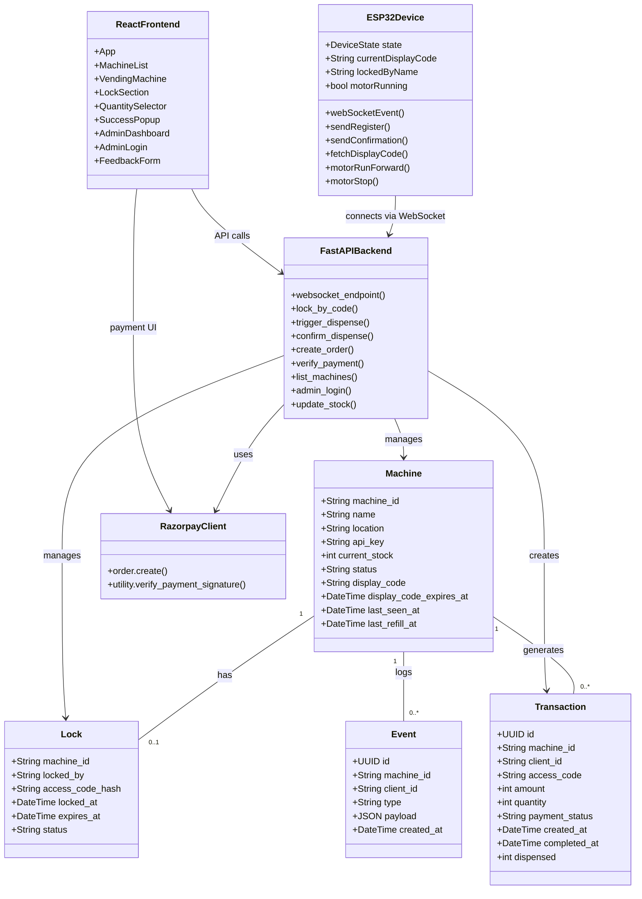
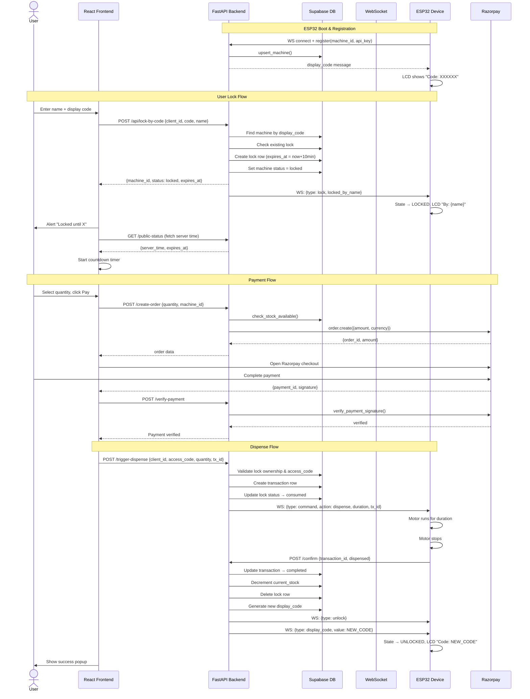
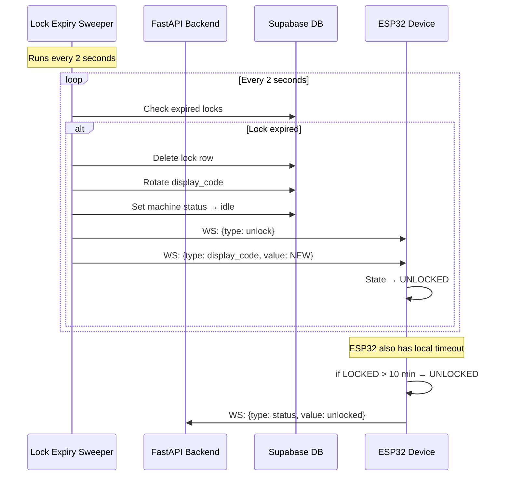
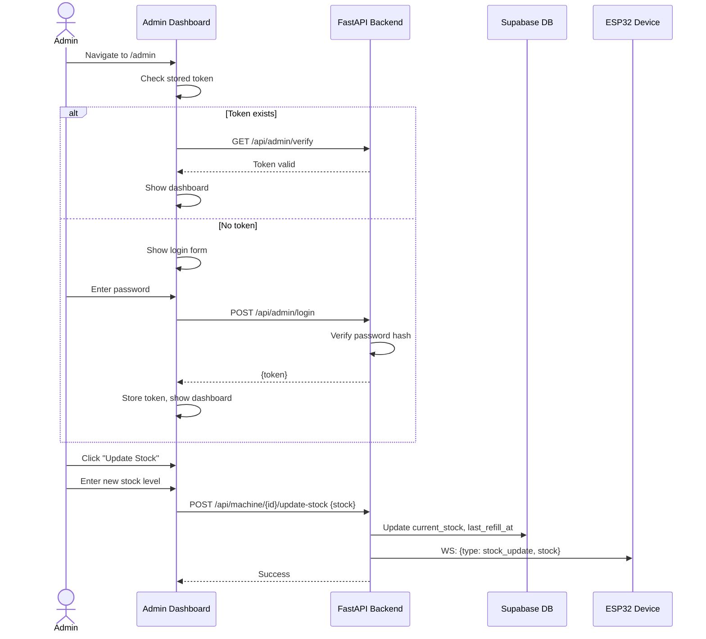
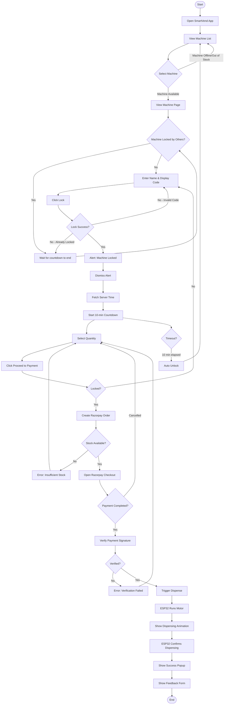
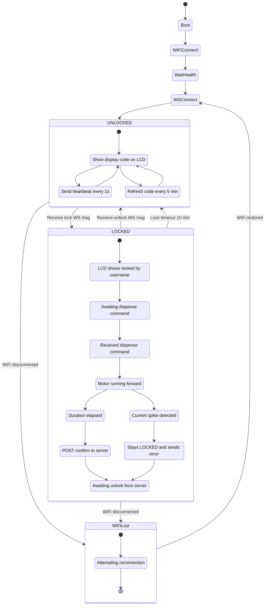
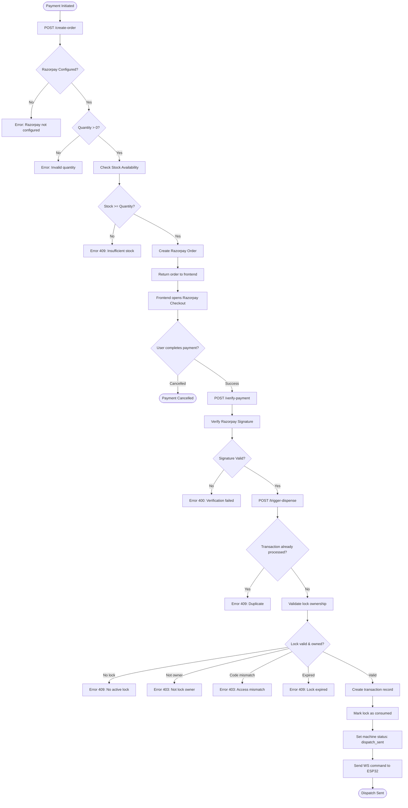
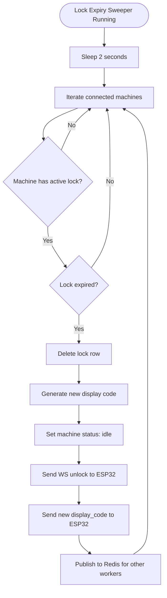

# SmartVend UML Diagrams

## 1. Use Case Diagram

```mermaid
graph TB
    subgraph Actors
        User["👤 User"]
        Admin["🔧 Admin"]
        ESP32["⚙️ ESP32 Device"]
        Razorpay["💳 Razorpay"]
    end

    subgraph SmartVend System
        UC1["View Machine List"]
        UC2["Lock Machine by Code"]
        UC3["Select Quantity"]
        UC4["Make Payment"]
        UC5["Receive Dispensed Item"]
        UC6["Submit Feedback"]
        UC7["Unlock Machine"]
        UC8["Admin Login"]
        UC9["View Dashboard"]
        UC10["Update Stock"]
        UC11["View Feedback"]
        UC12["Register Machine via WS"]
        UC13["Receive Dispense Command"]
        UC14["Confirm Dispensing"]
        UC15["Report Error"]
        UC16["Display Code on LCD"]
        UC17["Process Payment"]
        UC18["Verify Payment Signature"]
        UC19["Send Webhook Events"]
    end

    User --> UC1
    User --> UC2
    User --> UC3
    User --> UC4
    User --> UC5
    User --> UC6
    User --> UC7

    Admin --> UC8
    Admin --> UC9
    Admin --> UC10
    Admin --> UC11

    ESP32 --> UC12
    ESP32 --> UC13
    ESP32 --> UC14
    ESP32 --> UC15
    ESP32 --> UC16

    Razorpay --> UC17
    Razorpay --> UC18
    Razorpay --> UC19

    UC2 -.->|"includes"| UC16
    UC4 -.->|"includes"| UC17
    UC4 -.->|"includes"| UC18
    UC5 -.->|"includes"| UC13
    UC5 -.->|"includes"| UC14
```

---

## 2. Class Diagram

---

## 3. Sequence Diagrams

### 3.1 Lock and Dispense Flow

### 3.2 Lock Timeout Flow

### 3.3 Admin Operations Flow

---

## 4. Activity Diagrams

### 4.1 User Complete Flow

### 4.2 ESP32 State Machine

### 4.3 Payment Processing Activity

### 4.4 Server-Side Lock Expiry

