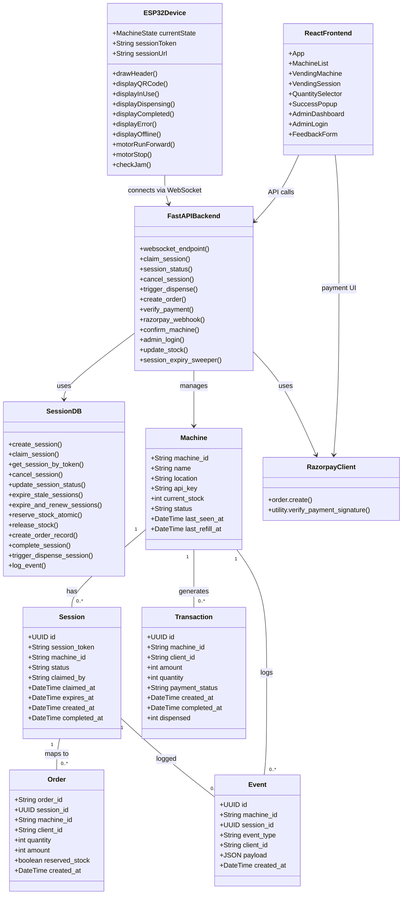
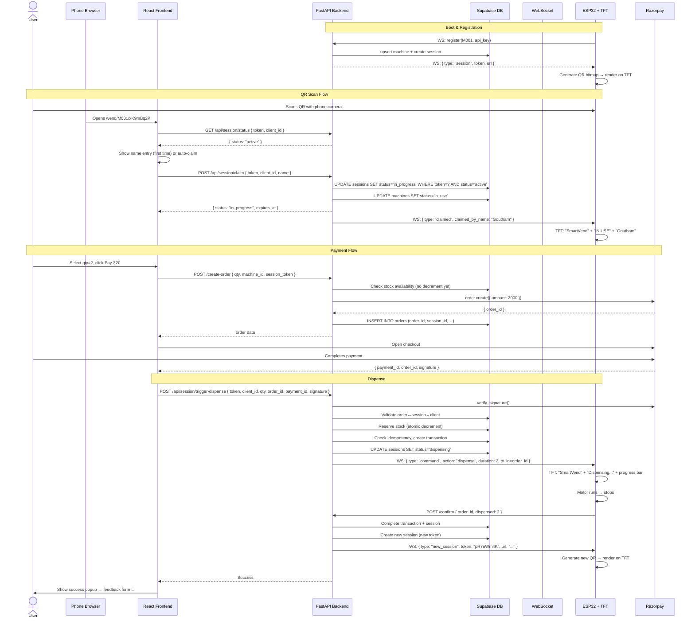
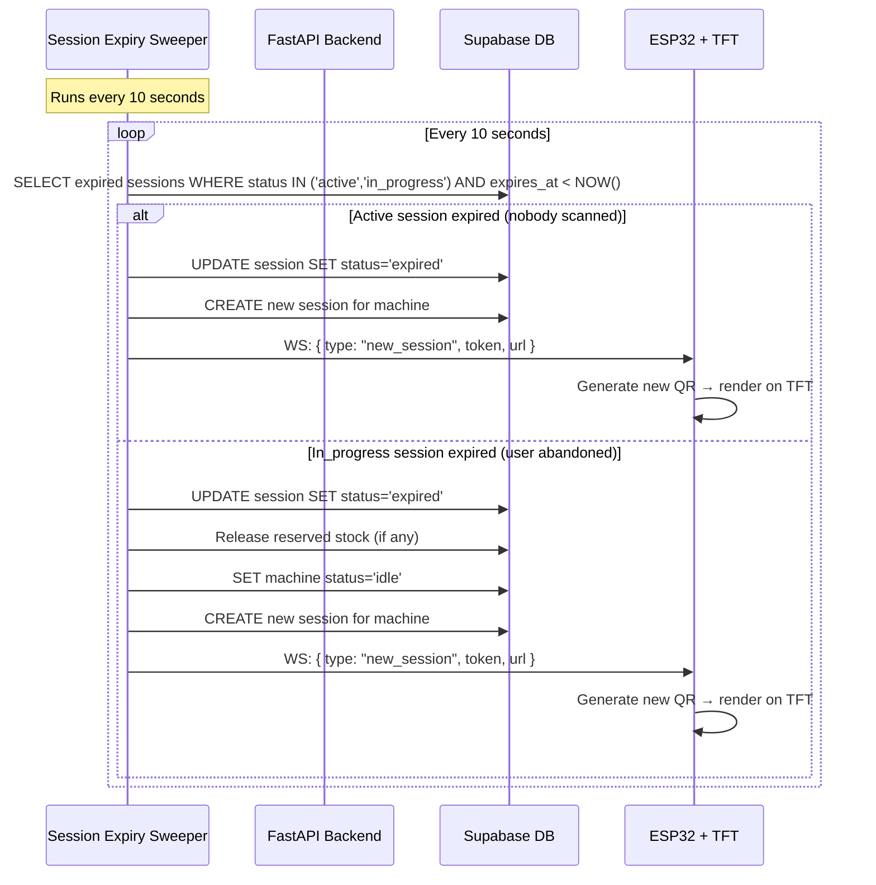
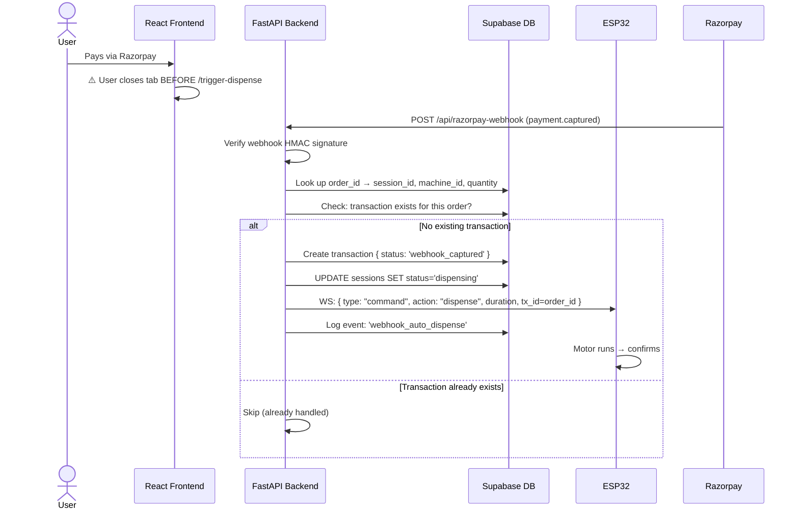
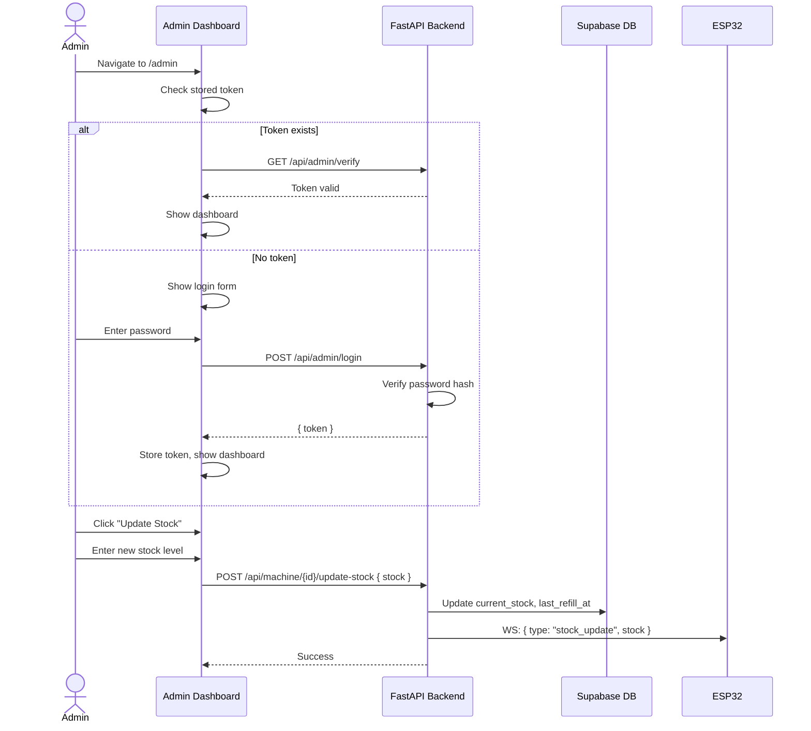
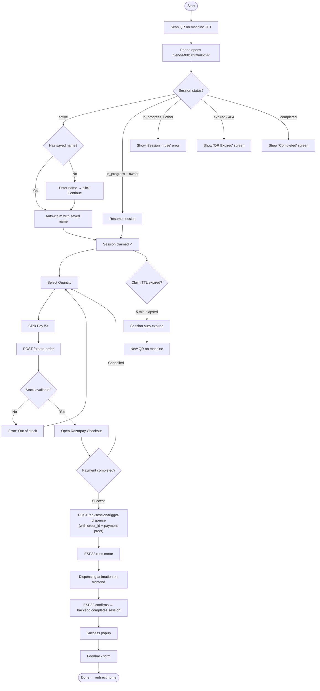
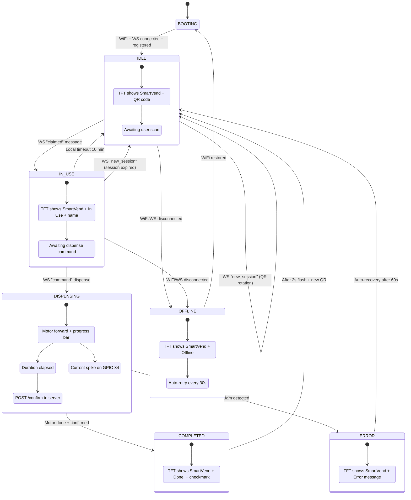
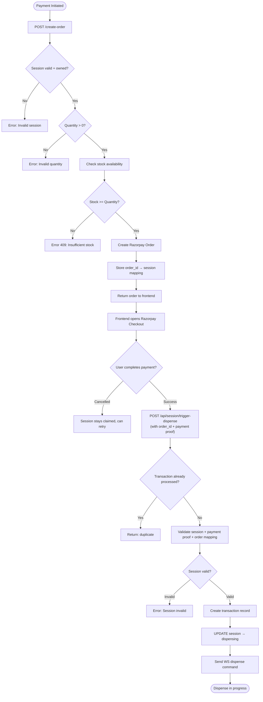
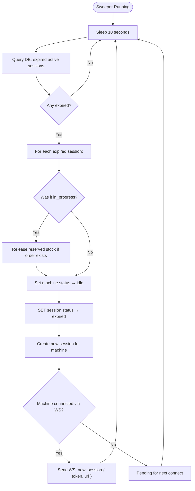

# SmartVend UML Diagrams (v3.0 — QR-Based)

## 1. Use Case Diagram

```mermaid
graph TB
    subgraph Actors
        User["👤 User"]
        Admin["🔧 Admin"]
        ESP32["⚙️ ESP32 + TFT"]
        Razorpay["💳 Razorpay"]
    end

    subgraph SmartVend System
        UC1["View Machine List"]
        UC2["Scan QR Code"]
        UC3["Claim Session"]
        UC4["Select Quantity"]
        UC5["Make Payment"]
        UC6["Receive Dispensed Item"]
        UC7["Cancel Session"]
        UC8["Submit Feedback"]
        UC9["Admin Login"]
        UC10["View Dashboard"]
        UC11["Update Stock"]
        UC12["View Feedback"]
        UC13["Register Machine via WS"]
        UC14["Render QR on TFT"]
        UC15["Receive Dispense Command"]
        UC16["Confirm Dispensing"]
        UC17["Report Error / Jam"]
        UC18["Process Payment"]
        UC19["Verify Signature"]
        UC20["Send Webhook Events"]
    end

    User --> UC1
    User --> UC2
    User --> UC3
    User --> UC4
    User --> UC5
    User --> UC6
    User --> UC7
    User --> UC8

    Admin --> UC9
    Admin --> UC10
    Admin --> UC11
    Admin --> UC12

    ESP32 --> UC13
    ESP32 --> UC14
    ESP32 --> UC15
    ESP32 --> UC16
    ESP32 --> UC17

    Razorpay --> UC18
    Razorpay --> UC19
    Razorpay --> UC20

    UC2 -.->|"triggers"| UC3
    UC5 -.->|"includes"| UC18
    UC5 -.->|"includes"| UC19
    UC6 -.->|"includes"| UC15
    UC6 -.->|"includes"| UC16
```



---

## 2. Class Diagram



---

## 3. Sequence Diagrams

### 3.1 QR Scan → Claim → Pay → Dispense (v3.0)



### 3.2 Session Expiry & QR Rotation



### 3.3 Webhook Reconciliation (Tab Closed After Payment)



### 3.4 Admin Operations



---

## 4. Activity Diagrams

### 4.1 User Complete Flow (v3.0)



### 4.2 ESP32 State Machine (v3.0)



### 4.3 Payment + Dispense Flow (v3.0)



### 4.4 Session Expiry Sweeper (v3.0)



---

## 5. Deployment Architecture

```mermaid
graph TB
    subgraph "User Devices"
        Phone["📱 Phone (QR Scan)"]
        Browser["🌐 Browser"]
    end

    subgraph "Cloud (Render)"
        Backend["FastAPI Backend<br/>uvicorn + WebSocket"]
    end

    subgraph "Supabase"
        DB["PostgreSQL<br/>machines, sessions, orders,<br/>transactions, events"]
    end

    subgraph "Redis"
        Redis["Redis Pub/Sub<br/>Cross-worker WS fanout"]
    end

    subgraph "Razorpay"
        RP["Payment Gateway<br/>Orders + Webhooks"]
    end

    subgraph "Hardware"
        ESP["ESP32 + TFT<br/>QR Code + Motor"]
    end

    Phone --> Browser
    Browser -->|HTTPS| Backend
    ESP -->|WSS| Backend
    ESP -->|HTTPS| Backend
    Backend -->|REST| DB
    Backend -->|PubSub| Redis
    Backend -->|REST| RP
    RP -->|Webhook| Backend
```
